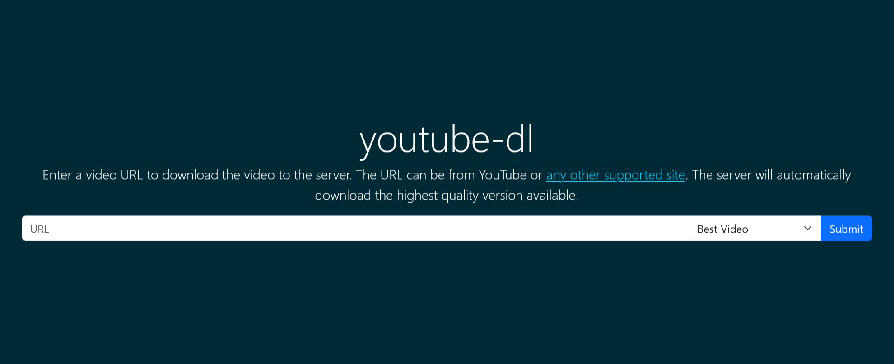

[](https://hub.docker.com/r/qx6ghqkz/youtube-dl-server/)
[](https://hub.docker.com/r/qx6ghqkz/youtube-dl-server/)
[](https://raw.githubusercontent.com/qx6ghqkz/youtube-dl-server/master/LICENSE)

# youtube-dl-server

Very spartan Web and REST interface for downloading YouTube videos onto a server. [`starlette`](https://github.com/encode/starlette) + [`yt-dlp`](https://github.com/yt-dlp/yt-dlp).

> [!IMPORTANT]
> This web server is no longer being actively developed in favour of [`gallery-dl-server`](https://github.com/qx6ghqkz/gallery-dl-server), which integrates yt-dlp and has much greater capabilities and support for configuration options.



## Running

### Docker CLI

This example uses the `docker run` command to create the container to run the app. We run the app with our host user `UID:GID` and on host port `7080`. Also note the `-v` arguments. The first directory can be used to store data files and the second directory will be used to output the downloaded videos.

```shell
docker run -d \
  --name youtube-dl \
  --user 1000:1000 \
  -p 7080:8080 \
  -v "/path/to/data:/data" \
  -v "/path/to/downloads:/youtube-dl" \
  --restart unless-stopped \
qx6ghqkz/youtube-dl-server:latest
```

### Docker Compose

This is an example service definition that could be put in `docker-compose.yml`. This service uses a VPN client container for its networking.

```yml
  youtube-dl:
    image: qx6ghqkz/youtube-dl-server:latest
    container_name: youtube-dl
    user: 1000:1000
    network_mode: container:vpn
    # ports:
    #   - 7080:8080
    volumes:
      - "/path/to/data:/data"
      - "/path/to/downloads:/youtube-dl"
    restart: unless-stopped
```

### Python

If you have Python ^3.6.0 installed in your PATH you can simply run like so, providing optional environment variable overrides inline. The `-u` flag is necessary to capture the output immediately.

```shell
YDL_UPDATE_TIME=False python3 -u -m uvicorn youtube-dl-server:app --port 8123
```

In this example, `YDL_UPDATE_TIME=False` is the same as the command line option `--no-mtime`.

### Ports

For publishing ports, the syntax is `HOST_PORT:CONTAINER_PORT`. The `HOST_PORT` can be set to any valid port number. The internal `CONTAINER_PORT` must be `8080` by default, but can be set to a different value using the `CONTAINER_PORT` environment variable. Specify environment variables using the `-e` option on the command line or in Docker Compose:

```yml
  youtube-dl:
    image: qx6ghqkz/youtube-dl-server:latest
    container_name: youtube-dl
    user: 1000:1000
    ports:
      - 7080:80
    environment:
      - CONTAINER_PORT=80
    volumes:
      - "/path/to/data:/data"
      - "/path/to/downloads:/youtube-dl"
    restart: unless-stopped
```

### Environment Variables

Environment variables can be set to change different settings. You can use the `-e` option with `docker run` or under `environment:` using a Docker Compose file, but it is best to use a separate `.env` file to list environment variables:

```shell
YDL_FORMAT=bestvideo[ext=mp4]+bestaudio[ext=m4a]/bestvideo+bestaudio/best
YDL_MERGE_OUTPUT_FORMAT=mp4/mkv
YDL_OUTPUT_TEMPLATE=/youtube-dl/%(title).200s [%(id)s].%(ext)s
YDL_NO_PLAYLIST=True
YDL_ARCHIVE_FILE=/data/archive.txt
YDL_COOKIES_FILE=/data/cookies.txt
YDL_IGNORE_ERRORS=True
YDL_WRITE_THUMBNAIL=True
YDL_THUMBNAIL_FORMAT=png/jpg
YDL_WRITE_SUBTITLES=True
YDL_SUBTITLES_FORMAT=srt/vtt/best
YDL_CONVERT_SUBTITLES=srt
YDL_SUBTITLES_LANGS=en.*,ja
YDL_EMBED_METADATA=True
```
The format is one environment variable per line with no quotation marks (these are only needed when specifying environment variables on the command line or in a `docker-compose.yml` file).

Specify the relative path to the `.env` file with `--env-file <path>` using `docker run` or `env_file: <path>` if using Docker Compose.

| Environment Variable      | Type           | Default Value                                  | Notes                                                |
| ------------------------- | -------------- |----------------------------------------------- | ---------------------------------------------------- |
| YDL_FORMAT                | String         | `"bestvideo+bestaudio/best"`                   |                                                      |
| YDL_EXTRACT_AUDIO_FORMAT  | String         | `None`                                         | Set via web interface                                |
| YDL_EXTRACT_AUDIO_QUALITY | String         | `"192"`                                        |                                                      |
| YDL_RECODE_VIDEO_FORMAT   | String         | `None`                                         | Set via web interface                                |
| YDL_MERGE_OUTPUT_FORMAT   | String         | `None`                                         |                                                      |
| YDL_OUTPUT_TEMPLATE       | String         | `"/youtube-dl/%(title).200s [%(id)s].%(ext)s"` |                                                      |
| YDL_NO_PLAYLIST           | Boolean        | `True`                                         | Only download video if URL also references playlist  |
| YDL_ARCHIVE_FILE          | String         | `None`                                         | Path to download archive, e.g. `"/data/archive.txt"` |
| YDL_COOKIES_FILE          | String         | `None`                                         | Path to cookie file, e.g. `"/data/cookies.txt"`      |
| YDL_COOKIES_BROWSER       | String         | `None`                                         | Name of browser, e.g. `"firefox"`                    |
| YDL_UPDATE_TIME           | Boolean        | `True`                                         |                                                      |
| YDL_IGNORE_ERRORS         | Boolean/String | `True`                                         | `True/False/"only_download"`                         |
| YDL_RESTRICT_FILENAMES    | Boolean        | `False`                                        |                                                      |
| YDL_GEO_BYPASS            | Boolean        | `False`                                        |                                                      |
| YDL_WRITE_THUMBNAIL       | Boolean        | `True`                                         | Thumbnail will be embedded                           |
| YDL_THUMBNAIL_FORMAT      | String         | `None`                                         | Image format to download and embed, e.g. `"png/jpg"` |
| YDL_WRITE_SUBTITLES       | Boolean        | `False`                                        | Subtitles will be embedded                           |
| YDL_SUBTITLES_FORMAT      | String         | `None`                                         | Subtitle format preference, e.g. `"srt/vtt/best"`    |
| YDL_CONVERT_SUBTITLES     | String         | `None`                                         | Convert subtitles to format, e.g. `"srt"`            |
| YDL_SUBTITLES_LANGS       | String         | `"all"`                                        | Can specify multiple, e.g. `"en.*,ja"`               |
| YDL_EMBED_METADATA        | Boolean        | `False`                                        |                                                      |

For more information on these options, see the [yt-dlp docs](https://github.com/yt-dlp/yt-dlp#usage-and-options) and [YouTubeDL object parameters](https://github.com/yt-dlp/yt-dlp/blob/12b248ce60be1aa1362edd839d915bba70dbee4b/yt_dlp/YoutubeDL.py#L176-L565).

## Usage

### Start a download remotely

Downloads can be triggered by supplying the `{{url}}` of the requested video through the Web UI or through the REST interface via curl, etc.

#### HTML

Just navigate to `http://{{host}}:7080/youtube-dl` and enter the requested `{{url}}`.

#### Curl

```shell
curl -X POST --data-urlencode "url={{url}}" http://{{host}}:7080/youtube-dl/q
```

#### Fetch

```javascript
fetch(`http://${host}:7080/youtube-dl/q`, {
  method: "POST",
  body: new URLSearchParams({
    url: url,
    format: "bestvideo"
  }),
});
```

#### Bookmarklet

Add the following bookmarklet to your bookmark bar so you can conveniently send the current page URL to your youtube-dl-server instance.

```javascript
javascript:!function(){fetch("http://${host}:7080/youtube-dl/q",{body:new URLSearchParams({url:window.location.href,format:"bestvideo"}),method:"POST"})}();
```

## Implementation

The server uses [`starlette`](https://github.com/encode/starlette) for the web framework and [`yt-dlp`](https://github.com/yt-dlp/yt-dlp) to handle the downloading. The integration with yt-dlp makes use of their [Python API](https://github.com/yt-dlp/yt-dlp#embedding-yt-dlp).

The Docker image is based on [`python:alpine`](https://registry.hub.docker.com/_/python/) and consequently [`alpine`](https://hub.docker.com/_/alpine/).
